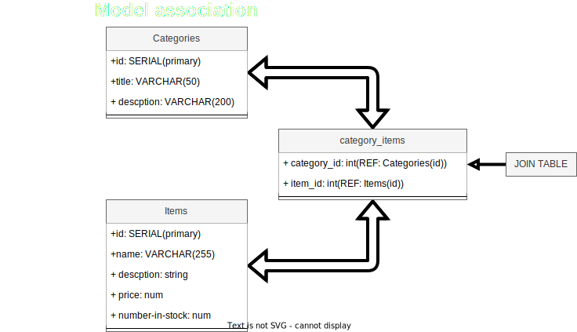

# Inventory management application

Welcome to The Odin Inventory Management Application, or TOIMA, a proof of concept prototype build to demonstrate the capabilities of a simple full stack application utilizing Node.js, Express, and mongoDB.

The project serves as a exercise in applying these technologies to create an efficient inventory management system

## Overview

TOIMA is a project I started as a way to solidify the fundamentals of full stack development. From structuring the backend using Node.js and Express, to populating and managing data with MongoDB, this prototype encapsulates the essence of creating a functional and scalable application.

## A learning experience.

This project emphasizes solidifying my abilities in resource management, maintaining a balance between various components, and adobting a goal-oriented approach, by breaking down tasks into manageable chunks. TOIMA demonstrates this step-by-step progression towards a fully realised application.

### Modular design

TOIMAs architecture follows a principle of modularity, thanks to the skeleton framework established by Express, and a strict adherence to ensuring each component serves a distinct purpose. With each schema and controller for each model, the codebase remains organized and easy to navigate.
This modular approach enhances maintainability, particularly as the application scales in complexity.

### Schema-Centric Controllers

In TOIMA, each schema is paired with a dedicated controller, streamlining CRUD operations for the corresponding model. Wether it's retrieval of data, or updating records, these controllers provide a clear and concise interface for interacting with the database. By adhering to a one-schema, one-controller structure, TOIMA simplifies development and debugging tasks, and makes way for future features and improvements. While this projects scope has been small, the approach can scale and tie to more and bigger data sets by adding more Schemas and controllers as needed

### Routing with Express

Leveraging Express's routing module, TOIMA seamlessly connects the frontend and backend components. Through defined routes, users can access various functionalities of the application, including viewing inventory items, adding new categories, and more.
This cohesive integration enables a smooth user experience.

## How does it work?

TOIMA uses the combined power of MongoDB, Node.js, and Express to deliver a simple and seamless experience for organizing and manipulating inventory data. And has served as a great experience to learn the capabilities of a well organized full stack project.
